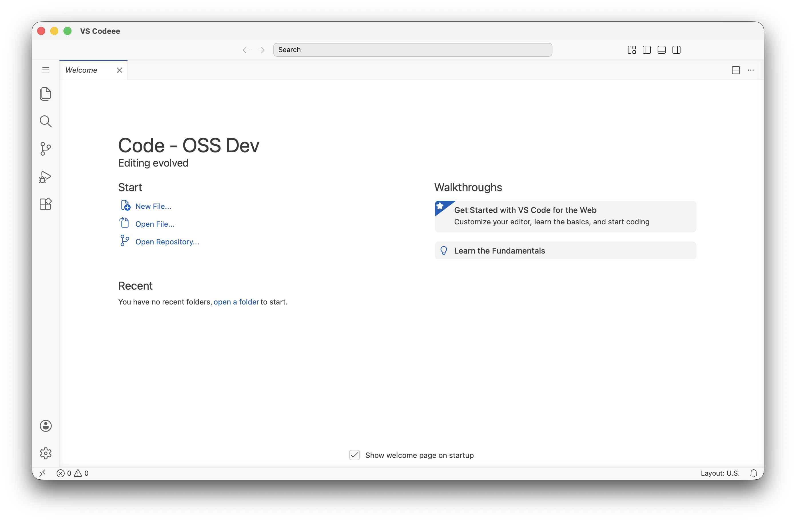

<div align="center">

# VS Codeee



</div>

**A project to run VSCode with Tauri 2.0**
In the process of gradual migration with Opus 4.6 :robot:

## Purpose

Maintain the current functionality of VSCode while achieving the following:

- **Reduce memory usage**: Electron → Tauri 2.0 (native WebView instead of bundled Chromium)
- **Reduce unnecessary metrics**: Stop sending telemetry to Microsoft
- **Smaller binary size**: ~50% reduction expected without bundled Chromium

---

## Roadmap

> **Current Phase: Phase 4 — Native Host Services** 📋

| Phase  | Name                                                             | Goal                                                    |                            Status                             |
| :----: | ---------------------------------------------------------------- | ------------------------------------------------------- | :-----------------------------------------------------------: |
|   0    | [Feasibility Spike](#phase-0-feasibility-spike)                  | Validate Tauri can host VS Code                         | [✅ Complete](https://github.com/j4rviscmd/vscodeee/issues/7) |
|   1    | [Foundation Layer](#phase-1-foundation-layer)                    | Render workbench shell in Tauri WebView                 |  [✅ Complete](https://github.com/j4rviscmd/vscodeee/pull/9)  |
|   2A   | [Functional File Editing](#phase-2a-functional-file-editing)     | Open, edit, and save local files                        | [✅ Complete](https://github.com/j4rviscmd/vscodeee/pull/17)  |
| **2B** | [**Editing Polish**](#phase-2b-editing-polish)                   | **File watchers, remaining native methods**             | [✅ Complete](https://github.com/j4rviscmd/vscodeee/pull/25)  |
|  3A    | [Window Registry](#phase-3-window-management)                    | Dynamic window IDs, scoped IPC, multi-window registry   | [✅ Complete](https://github.com/j4rviscmd/vscodeee/pull/31)  |
|  3B    | [Custom Title Bar](#phase-3-window-management)                   | Draggable title bar, traffic lights, window controls    | [✅ Complete](https://github.com/j4rviscmd/vscodeee/pull/34)  |
|  3C    | [State Persistence](#phase-3-window-management)                  | Window position/size + workspace session restore        | [✅ Complete](https://github.com/j4rviscmd/vscodeee/pull/36)  |
|  3D    | [Lifecycle Close Handshake](#phase-3-window-management)          | Two-phase close for reliable session restore            | [✅ Complete](https://github.com/j4rviscmd/vscodeee/pull/39)  |
| **4**  | [**Native Host Services**](#phase-4-native-host-services)        | **Dialogs, clipboard, shell, OS integration (~80 methods)** |                      **📋 Up Next**                           |
|   5    | [Process Model](#phase-5-process-model)                          | Extension Host, Terminal (PTY), Shared Process          |                          📋 Planned                           |
|   6    | [Platform Features](#phase-6-platform-features)                  | Auto-update, native menus, system tray                  |                          📋 Planned                           |
|   7    | [Build & Packaging](#phase-7-build--packaging)                   | Installers, code signing, CI/CD                         |                          📋 Planned                           |

---

<details>
<summary>Phase Details</summary>

### Phase 0: Feasibility Spike

**Status**: ✅ Complete (GO) — All sub-phases passed. See [Issue #7](https://github.com/j4rviscmd/vscodeee/issues/7).

| Sub-Phase                                  | Result | PR/Issue                                                   |
| ------------------------------------------ | :----: | ---------------------------------------------------------- |
| 0-1: Tauri Project Init                    |   ✅   | [PR #1](https://github.com/j4rviscmd/vscodeee/pull/1)      |
| 0-2: Extension Host Sidecar PoC            |   ✅   | [PR #2](https://github.com/j4rviscmd/vscodeee/pull/2)      |
| 0-3: Custom Protocol (`vscode-file://`)    |   ✅   | [PR #4](https://github.com/j4rviscmd/vscodeee/pull/4)      |
| 0-4: PTY Host (Rust `portable-pty`)        |   ✅   | [PR #3](https://github.com/j4rviscmd/vscodeee/pull/3)      |
| 0-5: BrowserView Alternative Investigation |   ✅   | [Issue #5](https://github.com/j4rviscmd/vscodeee/issues/5) |

### Phase 1: Foundation Layer

**Status**: ✅ Complete — [PR #9](https://github.com/j4rviscmd/vscodeee/pull/9)

Implemented the workbench shell that renders VS Code's full UI inside a Tauri 2.0 WebView with zero fatal errors.

**What was built:**

- Binary IPC protocol (base64-encoded VSBuffer over Tauri invoke/emit)
- 25+ core services registered (File, Storage, Remote, Configuration, etc.)
- Custom `vscode-file://` protocol handler for resource loading
- Tauri-specific platform layer (`tauri-browser/`) with environment, lifecycle, and host services
- 24 files changed, 2658 lines added

### Phase 2A: Functional File Editing

**Status**: ✅ Complete — [PR #17](https://github.com/j4rviscmd/vscodeee/pull/17)

The bridge from "UI renders" to "you can actually edit files." Implements `IFileSystemProvider` with direct Tauri `invoke()` calls — same pattern as `NativeHostService`. IPC binary routing is deferred to Phase 3 (needed for Extension Host, not for file editing).

| Task                       | Description                                      | Depends On | Status |
| -------------------------- | ------------------------------------------------ | ---------- | :----: |
| 2A-0: Pre-work             | Kill IPC echo router + add npm plugin packages   | —          |   ✅   |
| 2A-1: Local FileSystem     | Rust fs commands + `TauriDiskFileSystemProvider` | 2A-0       |   ✅   |
| 2A-2: UserData Persistence | Settings/state persisted to disk (real OS paths) | 2A-1       |   ✅   |
| 2A-3: File Dialogs         | `tauri-plugin-dialog` + `showMessageBox`         | 2A-1       |   ✅   |
| 2A-4: NativeHost Methods   | Clipboard, shell, window basics (~8 methods)     | 2A-0       |   ✅   |

```text
Architecture:

  TypeScript (WebView)                    Rust (Backend)
  ┌──────────────────────────┐           ┌──────────────────────┐
  │ TauriDiskFileSystemProvider│          │ #[tauri::command]     │
  │ implements IFileSystem-   │─invoke()─▶│ fs_stat, fs_read_file │
  │ Provider                  │          │   ↓ tokio::fs         │
  └──────────────────────────┘           │ Local Disk            │
                                         └──────────────────────┘
```

### Phase 2B: Editing Polish

**Status**: ✅ Complete — See [PR #25](https://github.com/j4rviscmd/vscodeee/pull/25).

| Sub-task                   | Description                                               | Depends on | Status |
| -------------------------- | --------------------------------------------------------- | ---------- | :----: |
| File Watcher               | Rust `notify` crate + `TauriWatcher` TypeScript bridge    | —          |   ✅   |
| Trash Support              | `trash` crate in `DiskFileSystemProvider`                 | —          |   ✅   |
| New Window (Cmd+Shift+N)   | `invoke('open_new_window')` via `TauriWorkspaceProvider`  | —          |   ✅   |
| NativeHost Methods         | `installShellCommand`, `killProcess`, `relaunch`, etc.    | —          |   ✅   |
| Runtime Bug Fixes          | Import strategy, watcher error handling, compilation fixes| —          |   ✅   |

### Phase 3: Window Management

Replace Electron `BrowserWindow` with Tauri `WebviewWindow`. Multi-window, title bar customization, auxiliary windows.

#### Phase 3A: Window Registry ✅

Centralized window management with unique monotonic IDs, `WindowManager` registry, scoped IPC delivery (`emit_to`), and `ITauriWindowService` DI integration. Foundation for all multi-window features.

| Task                          | Description                                                | Status |
| ----------------------------- | ---------------------------------------------------------- | :----: |
| Rust `window/` module         | state, manager, events, session modules                    |   ✅   |
| WindowManager registry        | Atomic ID generation, RwLock-based HashMap, label→ID map   |   ✅   |
| Scoped IPC                    | `emit_to(label)` instead of global `app.emit()`           |   ✅   |
| ITauriWindowService           | TS DI service for window lifecycle events                  |   ✅   |
| NativeHostService wiring      | `getWindows()`, `getWindowCount()`, event listeners        |   ✅   |
| Dynamic window label          | URL query param resolution for multi-window bootstrap      |   ✅   |

#### Phase 3B: Custom Title Bar ✅

Hide OS decorations, implement CSS-based draggable title bar with platform-appropriate window controls. See [PR #34](https://github.com/j4rviscmd/vscodeee/pull/34).

| Task                          | Description                                                | Status |
| ----------------------------- | ---------------------------------------------------------- | :----: |
| macOS decorations             | `decorations(false)` + `TitleBarStyle::Overlay`            |   ✅   |
| `isTauri` platform flag       | Add to `platform.ts`, gate `getTitleBarStyle()` → CUSTOM   |   ✅   |
| Drag region                   | `data-tauri-drag-region` on title bar                      |   ✅   |
| Window controls (Win/Linux)   | CSS minimize/maximize/close buttons                        |   ✅   |
| Tauri CSS                     | `titlebarpart.tauri.css` for platform-specific styles      |   ✅   |

#### Phase 3C: State Persistence ✅

Persist window position/size and workspace state across restarts using `tauri-plugin-window-state` and a custom `SessionStore`.

| Task                          | Description                                                | Status |
| ----------------------------- | ---------------------------------------------------------- | :----: |
| Window state plugin           | `tauri-plugin-window-state` for position/size persistence  |   ✅   |
| SessionStore                  | `sessions.json` read/write for workspace restoration       |   ✅   |
| Restore on launch             | Re-open same windows with same workspace on restart        |   ✅   |
| Settings reader               | JSONC-aware reader for `window.restoreWindows` setting     |   ✅   |
| 5 restore modes               | Strategy pattern: preserve/all/folders/one/none            |   ✅   |

#### Phase 3D: Lifecycle Close Handshake ✅

Two-phase close handshake between Rust and TypeScript to ensure IndexedDB writes complete before window destruction. Fixes editor tabs not being restored after session restore ([#35](https://github.com/j4rviscmd/vscodeee/issues/35)).

| Task                          | Description                                                | Status |
| ----------------------------- | ---------------------------------------------------------- | :----: |
| Rust close gate               | `api.prevent_close()` + emit to TS + 30s timeout           |   ✅   |
| TauriLifecycleService         | Full rewrite extending `AbstractLifecycleService` directly |   ✅   |
| Async veto support            | `fireBeforeShutdown` with async veto + `finalVeto`         |   ✅   |
| Storage flush before close    | `storageService.flush(SHUTDOWN)` before `window.destroy()` |   ✅   |
| Rust confirmed/vetoed cmds    | `lifecycle_close_confirmed` + `lifecycle_close_vetoed`     |   ✅   |

### Phase 4: Native Host Services

Implement all ~80 methods of `ICommonNativeHostService` using Tauri plugins (dialog, clipboard, shell, OS info, notification, etc.).

### Phase 5: Process Model

Extension Host via Node.js sidecar + named pipe, Terminal via Rust `portable-pty`, Shared Process services.

### Phase 6: Platform Features

Auto-update (`tauri-plugin-updater`), native menus, system tray, drag & drop, platform-specific integrations.

### Phase 7: Build & Packaging

Tauri build pipeline, code signing (macOS/Windows), installers (.dmg, .msi, .AppImage, .deb), CI/CD.

| Sub-task                    | Description                                                        | Status |
| --------------------------- | ------------------------------------------------------------------ | :----: |
| ThirdPartyNotices.txt       | Remove Electron deps, add Tauri/Rust dependency licenses ([#27](https://github.com/j4rviscmd/vscodeee/issues/27)) | 📋 Planned |
| LICENSES.chromium.html      | Bundled with Electron — not needed for Tauri                         | 📋 Planned |

</details>

---

## Architecture

```text
┌──────────────────────────────────────────┐
│           Tauri WebView (Renderer)       │
│  workbench.html + VS Code TypeScript     │
└──────────────┬───────────────────────────┘
               │  invoke / emit (Tauri IPC)
┌──────────────▼───────────────────────────┐
│           Tauri Rust Backend             │
│  • Custom Protocol (vscode-file://)      │
│  • PTY Manager (portable-pty)            │
│  • Window Management                     │
│  • Native Host Services                  │
└──────────────┬───────────────────────────┘
               │  socket / named pipe
┌──────────────▼───────────────────────────┐
│         Node.js Sidecar Processes        │
│  • Extension Host                        │
│  • Shared Process                        │
└──────────────────────────────────────────┘
```

## MVP Excluded Features

The following features depend on Chrome DevTools Protocol (CDP), which has no public API in Tauri's native WebViews (WKWebView / WebView2 / WebKitGTK). They are excluded from the MVP scope.

| Feature                                   | Reason                                     |
| ----------------------------------------- | ------------------------------------------ |
| AI Browser Tools (Copilot web automation) | CDP-dependent (click/drag/type/screenshot) |
| `vscode.BrowserTab` API (proposed)        | CDP-dependent, zero marketplace adoption   |
| Playwright integration                    | CDP-dependent browser automation           |
| Element inspection (`getElementData`)     | CDP-dependent DOM inspection               |
| Console log capture                       | CDP-dependent programmatic console access  |

> [!NOTE]
> These features may be revisited if Tauri adds CDP support in the future, or if alternative approaches become viable.

## Contributing

Issues and PRs are welcome.<br>
もちろん、日本語のコミュニケーション大歓迎です！

## License

MIT License — see [LICENSE](./LICENSE.txt) for details.
