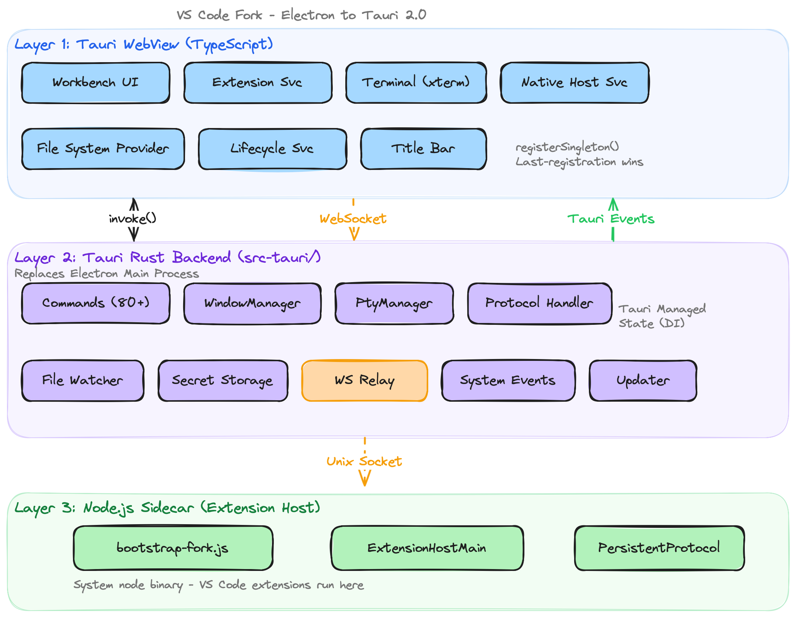

<div align="center">

# VS Codeee


English | [日本語](README.ja.md)

[](https://github.com/j4rviscmd/vscodeee/releases/latest)
[](https://github.com/j4rviscmd/vscodeee/releases/latest)
[](https://github.com/j4rviscmd/vscodeee/releases/latest)
[](https://github.com/j4rviscmd/vscodeee/releases/latest)
[](https://github.com/j4rviscmd/vscodeee/releases/latest)
[](https://github.com/j4rviscmd/vscodeee/actions)
[](./LICENSE.txt)

## A project to run VSCode with Tauri 2.0

</div>

## Motivation

While VSCode is an excellent editor, its Electron-based architecture leads to high memory usage. As a Neovim user (`neovim-vscode`), I was also frustrated that tmux-like operability couldn't be replicated.<br>
Although it's open source, the sheer scale of the project had kept me from attempting anything — but with today's LLMs being smarter than humans at vibe-coding, I figured these pain points could finally be solved, and so VSCodeee was born.<br>
This is developed as a side project, so feature implementations and bug fixes may be slow — your understanding is appreciated.<br>
Bug reports and feature requests are always welcome, so feel free to submit issues.

## Purpose

Maintain the current functionality of VSCode while achieving the following:

- **Reduce memory usage**: Electron → Tauri 2.0 (native WebView instead of bundled Chromium)
- **Reduce unnecessary metrics**: Stop sending telemetry to Microsoft
- **Smaller binary size**: No bundled Chromium (system WebView is used instead). Node.js is still bundled for extension host support
- **Transparent background** (experimental): Native window transparency support (macOS/Linux) — see the desktop through your editor
  - Future releases will explore more advanced appearance options such as full window transparency and blur effects
  - 
- [Settings and keybindings for Vimmers](#vscodeee-original-features)
- Regularly merge upstream VSCode to maintain the latest features and security patches

---

## Installation

| Platform              | Installer                                                                                                                                                                                                   |
| --------------------- | ----------------------------------------------------------------------------------------------------------------------------------------------------------------------------------------------------------- |
| macOS (Apple Silicon) | [`.dmg`](https://github.com/j4rviscmd/vscodeee/releases/latest/download/VSCodeee_macOS_arm64.dmg)                                                                                                           |
| macOS (Intel)         | [`.dmg`](https://github.com/j4rviscmd/vscodeee/releases/latest/download/VSCodeee_macOS_x64.dmg)                                                                                                             |
| Linux                 | [`.AppImage`](https://github.com/j4rviscmd/vscodeee/releases/latest/download/VSCodeee_Linux_x64.AppImage) / [`.deb`](https://github.com/j4rviscmd/vscodeee/releases/latest/download/VSCodeee_Linux_x64.deb) |
| Windows               | [`.exe`](https://github.com/j4rviscmd/vscodeee/releases/latest/download/VSCodeee_Windows_x64-setup.exe)                                                                                                     |

> [!NOTE]
> macOS builds use ad-hoc code signing (not Apple-notarized). On first launch, go to **System Settings > Privacy & Security** and click **Open Anyway**. Alternatively, run:
>
> ```bash
> xattr -dr com.apple.quarantine "/Applications/VS Codeee.app"
> ```

> [!NOTE]
> This project is developed and tested primarily on **macOS**. Windows and Linux builds are provided but have not been verified on those platforms.
> If you encounter any issues, please [open an issue](https://github.com/j4rviscmd/vscodeee/issues/new?template=bug_report.md).

---

## Architecture

<picture>
  <source media="(prefers-color-scheme: dark)" srcset="./docs/screenshots/vscodeee_architecture_dark.png">
  
</picture>

> **Note**: Shared Process (upstream VS Code's hidden renderer for gallery, sync, telemetry) is **eliminated** in VSCodeee. Its services are implemented directly in the WebView or Rust backend — see [#88](https://github.com/j4rviscmd/vscodeee/issues/88).

---

## VSCodeee Original Features

- tmux-like pane control keybindings
  - Pane resize commands
    - `vscodeee.resizePaneRight`
    - `vscodeee.resizePaneLeft`
    - `vscodeee.resizePaneUp`
    - `vscodeee.resizePaneDown`
- Display index prefix on editor groups (for tmux prefix + `n`)
  - `"vscodeee.workbench.editor.editorGroupIndexInTab": true`
- Suppress auto-maximize when focusing the smallest pane
  - `"vscodeee.workbench.editor.autoMaximizeOnFocus": false`
  - Upstream VSCode [issue#85309](https://github.com/microsoft/vscode/issues/85309)

---

## MVP Excluded Features

The following features depend on Chrome DevTools Protocol (CDP), which has no public API in Tauri's native WebViews (WKWebView / WebView2 / WebKitGTK). They are excluded from the MVP scope.

| Feature                                   | Reason                                     |
| ----------------------------------------- | ------------------------------------------ |
| AI Browser Tools (Copilot web automation) | CDP-dependent (click/drag/type/screenshot) |
| `vscode.BrowserTab` API (proposed)        | CDP-dependent, zero marketplace adoption   |
| Playwright integration                    | CDP-dependent browser automation           |
| Element inspection (`getElementData`)     | CDP-dependent DOM inspection               |
| Console log capture                       | CDP-dependent programmatic console access  |

The following Native Host Service features are deferred to post-MVP:

| Feature                    | Reason                                                                                                                                                 |
| -------------------------- | ------------------------------------------------------------------------------------------------------------------------------------------------------ |
| Microsoft Account login    | The built-in `microsoft-authentication` extension is bundled with `@azure/msal-node` and may work, but has not been verified in the Tauri environment. |
| Client credentials auth    | MVP supports authorization code flow only. Client credentials flow (`client_id` + `client_secret`) is deferred to post-MVP.                            |
| System proxy resolution    | Requires platform-specific APIs (CFNetwork, WinHTTP, libproxy). The `resolve_proxy` command returns `None` (direct connection).                        |
| System certificate loading | The `load_certificates` command returns an empty list. Extensions handle their own cert loading.                                                       |
| Kerberos authentication    | `lookupKerberosAuthorization` returns `undefined`. Requires a Kerberos library — rarely needed outside enterprise AD environments.                     |
| Window splash persistence  | `saveWindowSplash` is a no-op. Splash data is persisted via `localStorage` through `ISplashStorageService` instead.                                    |
| macOS Touch Bar            | Not supported by Tauri's WebView. The Touch Bar API methods are no-ops.                                                                                |
| macOS tab management       | Window tab APIs (`newWindowTab`, `mergeAllWindowTabs`, etc.) are no-ops.                                                                               |
| GPU info / content tracing | `openGPUInfoWindow`, `openContentTracingWindow`, `startTracing`, `stopTracing` are no-ops.                                                             |
| Screenshot capture         | `getScreenshot` returns `undefined`. Requires platform-specific screen capture APIs.                                                                   |

> [!TIP]
> These features may be revisited if Tauri adds CDP support in the future, or if alternative approaches become viable.

## Known Limitations

Architectural differences between Electron (bundled Chromium) and Tauri (native system WebView) introduce permanent or platform-specific limitations.

| Feature                   | Limitation                                                                                                                                                                                                       | Platform Details                                                                                                                                                                                |
| ------------------------- | ---------------------------------------------------------------------------------------------------------------------------------------------------------------------------------------------------------------- | ----------------------------------------------------------------------------------------------------------------------------------------------------------------------------------------------- |
| `setBackgroundThrottling` | WebView internal JS timer/animation throttling cannot be controlled externally                                                                                                                                   | All platforms — `NSProcessInfo.beginActivity()` (macOS) can prevent OS-level throttling, but WebView-internal behavior remains uncontrollable.                                                  |
| Settings Sync             | Built-in Settings Sync is unavailable. The upstream sync service is licensed exclusively for official VS Code builds.                                                                                            | All platforms — use third-party extensions (e.g., [Settings Sync](https://marketplace.visualstudio.com/items?itemName=Shan.code-settings-sync)) that sync via GitHub Gist as an alternative.    |
| Remote Tunnels            | Built-in Remote Tunnels is unavailable. The tunnel relay infrastructure is hosted by Microsoft (Azure Dev Tunnels) and is not accessible from third-party builds. Use Remote-SSH for remote development instead. | All platforms — see [#100](https://github.com/j4rviscmd/vscodeee/issues/100) for details. Remote-SSH is available as an alternative ([#185](https://github.com/j4rviscmd/vscodeee/issues/185)). |

> [!NOTE]
> This list covers inherent platform limitations. Features that are simply not yet implemented are tracked in individual GitHub Issues.

## License

MIT License — see [LICENSE](./LICENSE.txt) for details.
